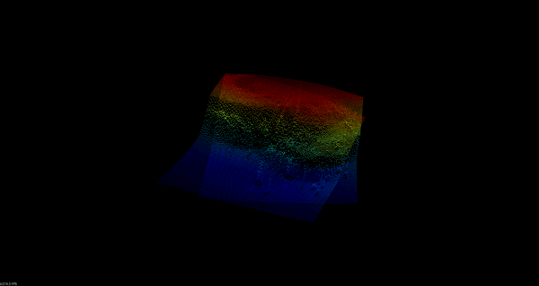

# SubmapsRegistration

Tools for keypoint detection, feature computation and correspondance matching in point clouds, with the focus on bathymetric data.



## Dependencies (Ubuntu 20.04)
* PCL  http://pointclouds.org/
* EIGEN http://eigen.tuxfamily.org/

## Building

Clone this repository and create a `build` folder under the root, then execute
```
cd build
cmake ..
make -j4
```

## Running
Avalible under the `bin` folder:
```
./submap_registration ../meshes/submap_1.pcd
```
And hit 'q' on the window to go through the registration steps:
1. Keypoints extraction
2. Correspondance matching between the keypoints features
3. Initial alingment based on the correspondances
4. GICP registration
5. Exit
